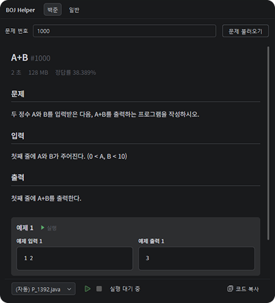
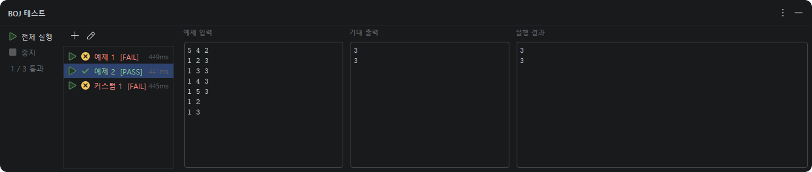
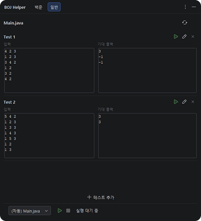
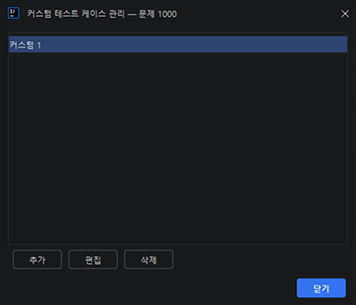
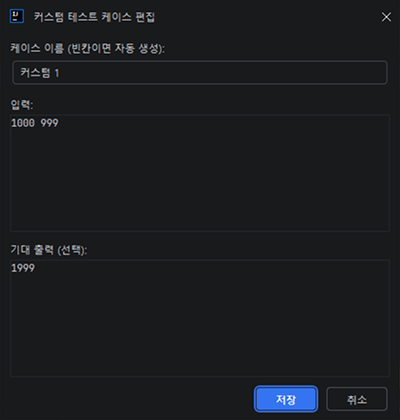

# BOJ Helper

View and test Baekjoon Online Judge problems directly in your JetBrains IDE.

> 백준 온라인 저지 문제를 JetBrains IDE에서 바로 보고 테스트하세요.

<!-- 백준 탭 스크린샷 -->

## 주요 기능

### 문제 자동 불러오기
파일명에서 문제 번호를 자동 인식합니다. `Boj1000.java`, `Main_1000.py` 같은 파일을 열면 해당 문제가 자동으로 로딩됩니다. 직접 문제 번호를 입력할 수도 있습니다.

### 수식 렌더링
LaTeX 수식을 포함한 문제를 MathJax로 렌더링합니다. JCEF를 지원하는 IDE에서는 백준 웹사이트와 동일한 형태로 문제를 볼 수 있습니다.

### 샘플 테스트 실행
샘플 입출력을 로컬에서 실행하고 결과를 자동으로 비교합니다.

- **Pass** — 출력이 예상 결과와 일치
- **Fail** — 출력 불일치, 런타임 에러, 또는 시간 초과
- 출력 비교 시 후행 공백과 빈 줄은 무시합니다

### 일반 테스트
백준 문제가 아닌 일반 코드 파일에서도 입출력 테스트를 실행할 수 있습니다. BOJ Helper 도구 창의 일반 탭에서 테스트 케이스를 추가하고 실행합니다.

### 커스텀 테스트 케이스
샘플 외에 직접 테스트 케이스를 추가하고 관리할 수 있습니다.

### 코드 복사
백준 제출용으로 클립보드에 복사합니다. Java 코드의 경우, 클래스명을 `Main`으로 자동 변환합니다.

## 지원 언어

| 언어 | 실행 방식 |
|------|-----------|
| Java | `java` 명령어로 컴파일 및 실행 |
| Kotlin | `kotlin` 명령어로 실행 |
| Python | 프로젝트 인터프리터 자동 감지 |

## 설치

### JetBrains Marketplace
1. **Settings** → **Plugins** → **Marketplace**
2. "BOJ Helper" 검색
3. **Install** 클릭

### 수동 설치
1. [Releases](https://github.com/putdata/BOJ-JetBrains-Plugin/releases)에서 `.zip` 파일 다운로드
2. **Settings** → **Plugins** → ⚙️ → **Install Plugin from Disk...**

## 사용법

1. 파일명에 문제 번호를 포함하여 파일을 생성합니다 (예: `Boj1000.java`)
2. 우측 **BOJ Helper** 도구 창에서 문제가 자동으로 로딩됩니다
3. 코드를 작성한 후 **실행** 버튼을 클릭합니다
4. 하단 **BOJ 테스트** 도구 창에서 결과를 확인합니다

## 호환성

- **IDE:** IntelliJ IDEA, PyCharm, WebStorm 등 JetBrains IDE
- **버전:** 2021.3 이상
- **수식 렌더링:** JCEF 지원 IDE (미지원 시 텍스트 폴백)

## 피드백

버그 리포트나 기능 요청은 [GitHub Issues](https://github.com/putdata/BOJ-JetBrains-Plugin/issues)에 남겨주세요.
